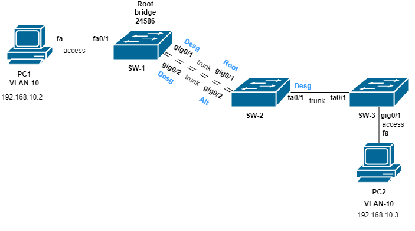

# STP (Spanning Tree Protocol) Lab

## 🎯 Objective
This lab demonstrates the configuration of **Spanning Tree Protocol (STP)** to prevent network loops in a redundant network setup. The goal is to ensure stable network operation by eliminating the risk of creating cyclic connections, which could disrupt the network's normal functioning.

## 🧱 Network Topology

The network consists of **two PCs** (PC1 and PC2) and **three switches** (SW1, SW2, SW3) connected in a redundant loop. The Spanning Tree Protocol (STP) will be configured to block one of the redundant links, ensuring there is only one active path between devices.

**Network Diagram:**

SW1# show spanning-tree vlan 10

SW2# show spanning-tree vlan 10

SW3# show spanning-tree vlan 10

🌐 Ping Test
Once the STP configuration is complete, a ping test is conducted to ensure connectivity between the devices connected to the switches:
PC1 (SW1) to PC2 (SW3):
ping 192.168.20.10
