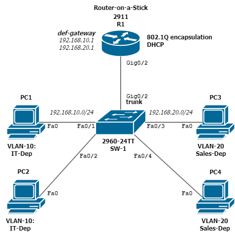
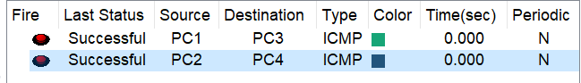

# 🧪 VLAN + InterVLAN Routing Lab (Cisco Packet Tracer)

This is a simple lab to show how to use VLANs and router-on-a-stick to allow devices in different VLANs to communicate.

---

## 🎯 Goal

- Create two VLANs: one for IT, one for Sales
- Use a router (Cisco 2911) to allow communication between them
- Assign static IP addresses to all PCs

---

## 🧱 Topology

- **Router:** Cisco 2911 (R1)
- **Switch:** Cisco 2960-24TT (SW-1)
- **PCs:** 4 PCs in total (2 per VLAN)

| Device | VLAN | IP Address       | Default Gateway   |
|--------|------|------------------|-------------------|
| PC1    | 10   | 192.168.10.3    | 192.168.10.1      |
| PC4    | 10   | 192.168.20.3    | 192.168.20.1      |
| PC2    | 20   | 192.168.10.4    | 192.168.10.1      |
| PC3    | 20   | 192.168.20.4    | 192.168.20.1      |

---
Result:

